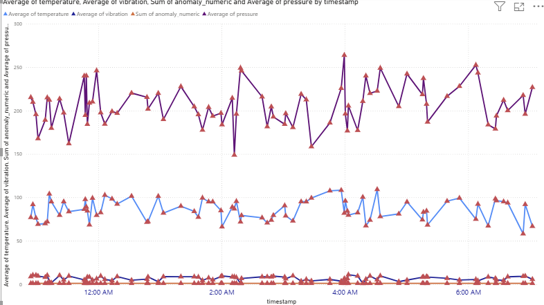

# 📡 Oil Field Equipment Monitoring & Anomaly Detection

> **An end-to-end equipment monitoring system that analyzes industrial sensor data, detects abnormal equipment behavior, and visualizes operational trends using Python, Azure SQL, and Power BI.**

---

## 🚀 Overview

Modern industrial equipment continuously generates thousands of sensor readings every day. Detecting unusual behavior early can significantly reduce maintenance costs, prevent unexpected failures, and improve operational efficiency.

This project simulates a real-world industrial monitoring pipeline by processing equipment sensor data, identifying abnormal operating conditions, storing processed records in a SQL database, and presenting actionable insights through an interactive Power BI dashboard.

Under Review 07/20 -07/24
---

# 🎯 Project Goals

- Monitor equipment health using sensor telemetry
- Detect abnormal operating conditions
- Store cleaned data in a relational database
- Build an interactive business intelligence dashboard
- Demonstrate a complete analytics workflow from data processing to visualization

---

# 🏗️ System Architecture

```text
                Sensor Data
                     │
                     ▼
        Python Data Processing
      (Cleaning + Validation +
       Anomaly Detection)
                     │
                     ▼
          Azure SQL Database
                     │
                     ▼
          Power BI Dashboard
                     │
                     ▼
      Equipment Health Insights
```

---

# 🛠️ Technology Stack

| Technology | Purpose |
|------------|---------|
| 🐍 Python | Data preprocessing and anomaly detection |
| 🐼 Pandas | Data cleaning and transformation |
| 🗄️ Azure SQL Database | Data storage and querying |
| 📊 Power BI | Interactive dashboards |
| 🔄 Power Query | Data transformation inside Power BI |
| 📝 SQL | Database management and analytics |

---

# 🔄 Data Pipeline

## 1️⃣ Data Collection

Sensor readings are generated or collected from industrial equipment, including:

- 🌡️ Temperature
- ⚙️ Pressure
- 📈 Vibration

---

## 2️⃣ Data Processing (Python)

Using **Pandas**, the pipeline:

- Cleans missing or inconsistent values
- Formats timestamps
- Standardizes sensor measurements
- Applies anomaly detection rules
- Prepares data for storage

---

## 3️⃣ Database Storage

Processed sensor records are loaded into an **Azure SQL Database**, making the data available for querying and business intelligence reporting.

---

## 4️⃣ Visualization (Power BI)

Power BI connects directly to the SQL database to provide:

- Interactive dashboards
- Equipment health monitoring
- Trend analysis
- Anomaly visualization
- Drill-down filtering

---

# 📂 Dataset

Each sensor reading contains the following information:

| Column | Description |
|---------|-------------|
| `timestamp` | Date and time of the reading |
| `equipment_id` | Unique equipment identifier |
| `temperature` | Equipment temperature |
| `pressure` | Pressure measurement |
| `vibration` | Vibration intensity |
| `anomaly_status` | Normal or abnormal reading |

---

# 🤖 Anomaly Detection

This project implements a **rule-based anomaly detection system**.

A sensor reading is flagged as abnormal whenever one or more predefined thresholds are exceeded.

### Detection Rules

- 🌡️ Temperature exceeds threshold
- ⚙️ Pressure exceeds threshold
- 📈 Vibration exceeds threshold

If **any** threshold is violated, the record is labeled as an anomaly.

---

# 📈 Dashboard Features

✔️ Interactive time-series visualizations

✔️ Equipment performance monitoring

✔️ Multi-sensor comparison

✔️ Anomaly highlighting

✔️ Dynamic filtering

✔️ Trend exploration

✔️ Clean and responsive dashboard design

---

# 🔥 Key Insights

The dashboard helps identify:

- Equipment operating trends over time
- Temperature spikes
- Pressure fluctuations
- Abnormal vibration patterns
- Potential maintenance events
- Early warning signs before equipment failure

---

# 📸 Dashboard Preview

> 

```
/images/dashboard-overview.png
/images/anomaly-analysis.png
/images/trend-monitoring.png
```

---

# 🚀 Future Improvements

- 🤖 Machine Learning anomaly detection
- 📡 Real-time IoT sensor streaming
- 🔔 Automated email/SMS alerting
- ☁️ Azure cloud deployment
- 📈 Predictive maintenance forecasting
- ⚡ Live Power BI dashboards
- 📊 Historical equipment performance analytics

---

# 💼 Real-World Applications

This project demonstrates concepts commonly used in:

- Oil & Gas Operations
- Manufacturing
- Industrial Automation
- Smart Factories
- Predictive Maintenance
- Industrial IoT (IIoT)
- Asset Performance Management

---

# 📁 Project Structure

```
Oil-Field-Equipment-Monitoring/
│
├── data/
│   ├── raw/
│   └── processed/
│
├── notebooks/
│
├── scripts/
│   ├── preprocess.py
│   ├── anomaly_detection.py
│   └── load_to_sql.py
│
├── sql/
│   └── database_schema.sql
│
├── powerbi/
│   └── EquipmentMonitoring.pbix
│
├── images/
│
├── requirements.txt
│
└── README.md
```

---

# 📚 Skills Demonstrated

- Python Data Engineering
- Data Cleaning
- SQL Development
- Azure SQL Database
- Power BI Dashboard Development
- ETL Pipeline Design
- Rule-Based Anomaly Detection
- Industrial Data Analytics
- Business Intelligence
- Data Visualization

---

# ⭐ Support

If you found this project helpful or interesting, consider giving it a **⭐ Star** on GitHub!

It helps support future projects and makes the repository easier for others to discover.


